# Linux IPC in C — A Visual Portfolio Repository

> A structured, code-first guide to Linux Inter-Process Communication with **theory**, **original diagrams**, **annotated C examples**, and a **capstone project** that combines multiple IPC mechanisms in one system.

[](LICENSE)
[]()
[]()
[]()


---

## Table of Contents

- [Why This Repository Exists](#why-this-repository-exists)
- [Portfolio Highlights](#portfolio-highlights)
- [Visual Overview](#visual-overview)
- [Repository Goals](#repository-goals)
- [IPC at a Glance](#ipc-at-a-glance)
- [Linux IPC Taxonomy](#linux-ipc-taxonomy)
- [1. Pipe & FIFO](#1-pipe--fifo)
- [2. POSIX Message Queue](#2-posix-message-queue)
- [3. POSIX Shared Memory](#3-posix-shared-memory)
- [4. POSIX Semaphore](#4-posix-semaphore)
- [5. Socket](#5-socket)
- [6. Signal](#6-signal)
- [Choosing the Right IPC Mechanism](#choosing-the-right-ipc-mechanism)
- [IPC Comparison Matrix](#ipc-comparison-matrix)
- [7. Capstone Project: Distributed Task Manager](#7-capstone-project-distributed-task-manager)
- [Building & Running](#building--running)
- [Project Structure](#project-structure)
- [GitHub Setup Notes](#github-setup-notes)
- [Source Map](#source-map)
- [References](#references)

---

## Why This Repository Exists

Linux isolates processes by design: each process has its own virtual address space, its own file descriptor table, and its own execution context. That isolation improves security and stability, but it also means processes need **explicit kernel-supported mechanisms** to cooperate.

**Inter-Process Communication (IPC)** is the umbrella term for those mechanisms.

This repository was prepared as a **portfolio-grade learning project** for Linux systems programming. The goal is not only to show code that compiles, but to show that the design choices behind IPC are understood:

1. **How data moves** between processes.
2. **How shared state is exposed** safely.
3. **How coordination is enforced** with synchronization primitives.
4. **How events are delivered** asynchronously.

This repo focuses on the IPC mechanisms that appear most often in Linux systems programming:

| # | Mechanism | Main Role | Typical APIs |
|---|-----------|-----------|--------------|
| 1 | **Pipe / FIFO** | Stream data transfer | `pipe()`, `mkfifo()`, `read()`, `write()` |
| 2 | **POSIX Message Queue** | Message-oriented communication | `mq_open()`, `mq_send()`, `mq_receive()` |
| 3 | **POSIX Shared Memory** | Fast shared state / zero-copy access | `shm_open()`, `ftruncate()`, `mmap()` |
| 4 | **POSIX Semaphore** | Synchronization / mutual exclusion | `sem_open()`, `sem_wait()`, `sem_post()` |
| 5 | **Socket** | Bidirectional local or network communication | `socket()`, `bind()`, `listen()`, `accept()` |
| 6 | **Signal** | Asynchronous event notification | `kill()`, `sigaction()`, `pause()` |

---

## Portfolio Highlights

This repository is designed to be readable by both:

- someone **studying Linux IPC for the first time**, and
- someone **reviewing systems programming portfolio work** on GitHub.

What makes the project stronger as a portfolio piece:

- **Original visual assets** for IPC overview and selection logic
- **Readable section-by-section architecture explanations**
- **API-level explanations** connected to concrete C examples
- **A comparison mindset** rather than isolated demos only
- **A capstone design** that combines multiple IPC mechanisms in one architecture
- **Source mapping** to authoritative Linux systems programming material

---

## Visual Overview

### Static architecture overview

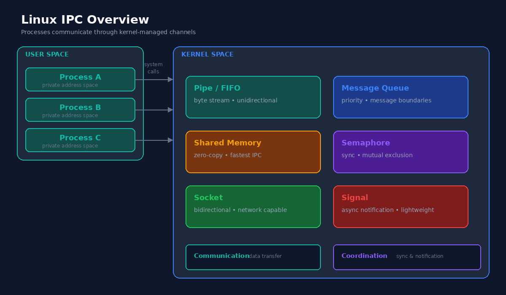

### Static selection guide

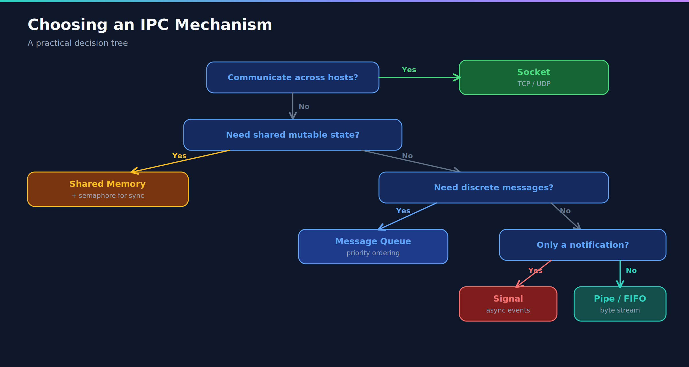

These PNG diagrams are included so the repository still looks polished in contexts where Mermaid previews are limited.

---

## Repository Goals

This repo is designed as both a **study resource** and a **portfolio project**.

It tries to answer three practical questions:

- **What problem does this IPC method solve best?**
- **How does the kernel make it work?**
- **What tradeoffs do I accept when I choose it?**

So each section includes:

- a conceptual explanation,
- a diagram,
- Linux/POSIX API notes,
- use cases,
- pros/cons,
- and example files from `src/`.

---

## IPC at a Glance

The first big idea is simple:

- **Processes do not directly access each other’s private memory.**
- They interact through **kernel-managed IPC objects** or through **shared mappings** established by the kernel.

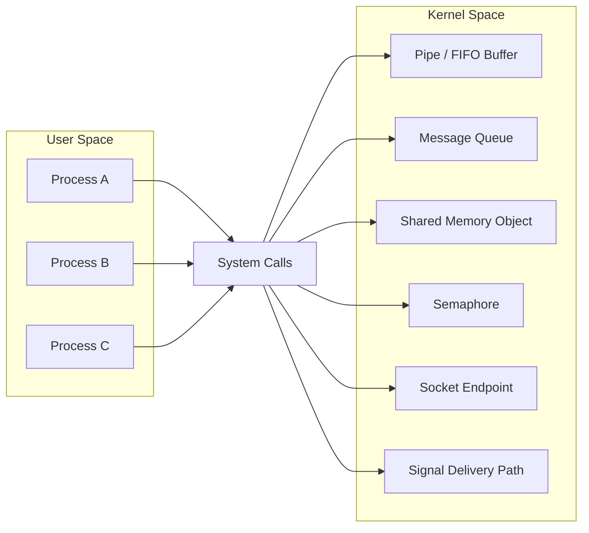

### Key observation

Not every IPC method behaves the same way:

- Some are **byte streams**.
- Some are **message-oriented**.
- Some are for **data movement**.
- Some are for **synchronization only**.
- Only one family, **sockets**, naturally extends to the network.

---

## Linux IPC Taxonomy

A useful way to understand IPC is to group mechanisms by what they primarily do.

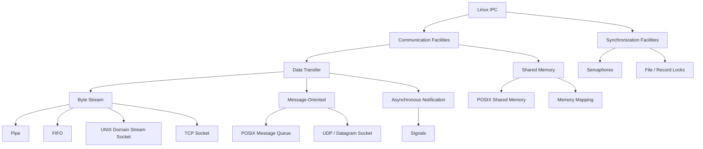

This taxonomy is useful because it prevents a common beginner mistake: treating all IPC methods as “different ways to do the same thing.” They are not. They solve **different communication models**.

---

## 1. Pipe & FIFO

A **pipe** is the classic UNIX IPC mechanism: a unidirectional kernel buffer with one writer end and one reader end.

- `pipe()` creates an **unnamed pipe**.
- `mkfifo()` creates a **named pipe (FIFO)** represented in the filesystem.

### Mental model

- Writer copies bytes into a kernel buffer.
- Reader copies bytes out of that buffer.
- The kernel automatically handles blocking when the pipe is empty/full.


### Unnamed pipe vs FIFO

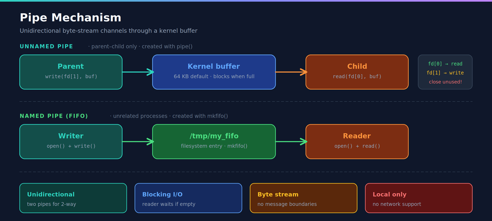

| Feature | Unnamed Pipe | FIFO |
|---|---|---|
| Creation | `pipe()` | `mkfifo()` |
| Naming | No pathname | Filesystem pathname |
| Typical use | Parent-child / related processes | Unrelated processes on same host |
| Lifetime | Exists while descriptors remain open | FIFO special file remains until removed |
| Direction | Unidirectional | Unidirectional by design (bidirectional often simulated with two FIFOs) |

### Why pipes are powerful

Even though the API is small, pipes integrate beautifully with `fork()`, `dup2()`, and `exec()`. That is why shell pipelines work so naturally.

```bash
cat access.log | grep 500 | sort | uniq -c
```

### When to use pipes

- parent-child data flow,
- filter chains,
- redirection,
- lightweight local streaming,
- simple producer → consumer setups.

### Strengths and weaknesses

| Advantages | Disadvantages |
|---|---|
| Very simple API | Usually unidirectional |
| Built-in blocking and flow control | Byte stream only, no message boundaries |
| Works naturally with `fork()` and shell pipelines | Unnamed pipes are best for related processes |
| File descriptor based, so works with `select()` / `poll()` / `epoll()` | Local machine only |

### Example files

| File | Description |
|------|-------------|
| [`01_basic_pipe.c`](src/01_pipe/01_basic_pipe.c) | Minimal parent-child pipe example |
| [`02_bidirectional_pipe.c`](src/01_pipe/02_bidirectional_pipe.c) | Two pipes for two-way communication |
| [`03_pipe_redirect.c`](src/01_pipe/03_pipe_redirect.c) | Capture a child's stdout via `dup2()` — how shells implement pipelines |
| [`04_named_pipe_writer.c`](src/01_pipe/04_named_pipe_writer.c) | FIFO writer |
| [`05_named_pipe_reader.c`](src/01_pipe/05_named_pipe_reader.c) | FIFO reader |

---

## 2. POSIX Message Queue

A **POSIX message queue** stores **discrete messages** in the kernel, rather than a raw byte stream.

This matters because message boundaries are preserved.

### Mental model

- Sender places a complete message into a named queue.
- Receiver removes one complete message at a time.
- Messages can have **priorities**.
- The queue itself is a persistent kernel object until unlinked.

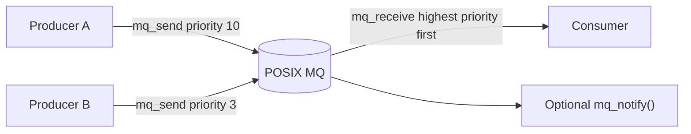

### Why message queues differ from pipes

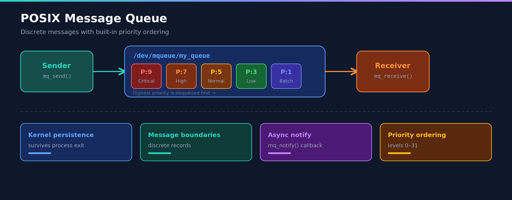

Pipes are “just bytes.” Message queues are **records**.

That makes queues a better fit for:

- task dispatching,
- event buses,
- alert channels,
- priority scheduling,
- decoupled producer-consumer systems.

### Typical workflow

1. `mq_open()` creates or opens the queue.
2. `mq_send()` pushes a message into the queue.
3. `mq_receive()` pops a full message out.
4. `mq_close()` releases the descriptor.
5. `mq_unlink()` removes the queue object.

### Strengths and weaknesses

| Advantages | Disadvantages |
|---|---|
| Preserves message boundaries | More API surface than pipes |
| Supports priorities | Queue limits and message size limits apply |
| Useful for unrelated processes | Local machine only |
| Optional async notification with `mq_notify()` | Requires cleanup (`mq_unlink()`) |
| Good for dispatcher/worker patterns | Usually slower than shared memory for large payloads |

### Example files

| File | Description |
|------|-------------|
| [`01_mq_basic_send.c`](src/02_message_queue/01_mq_basic_send.c) | Basic sender |
| [`02_mq_basic_receive.c`](src/02_message_queue/02_mq_basic_receive.c) | Basic receiver |
| [`03_mq_priority.c`](src/02_message_queue/03_mq_priority.c) | Priority ordering demo |
| [`04_mq_notify.c`](src/02_message_queue/04_mq_notify.c) | Asynchronous arrival notification |

---

## 3. POSIX Shared Memory

**Shared memory** is the fastest general-purpose IPC mechanism on the same host because the kernel does not need to copy the data for every read/write operation after the mapping is established.

### Mental model

The kernel maps the same physical pages into multiple processes.

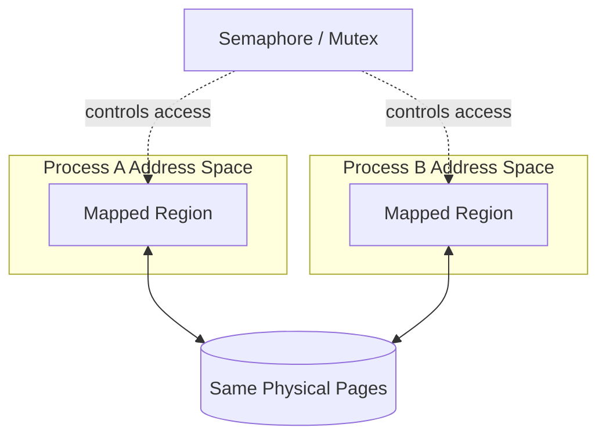

### Typical workflow

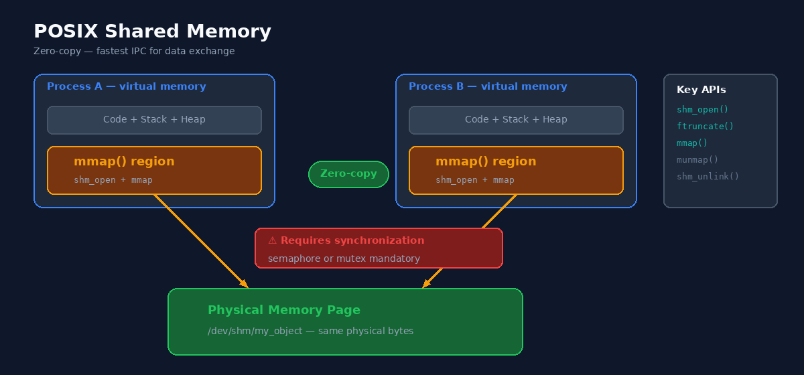

1. `shm_open()` creates or opens a shared memory object.
2. `ftruncate()` sets its size.
3. `mmap()` maps it into one or more processes.
4. Processes read/write the region like normal memory.
5. `munmap()`, `close()`, and `shm_unlink()` release resources.

### Why shared memory is fast

For stream/message IPC, data usually travels like this:

- user space → kernel buffer
- kernel buffer → user space

Shared memory avoids this repeated copying during normal communication. That is why it is common in high-throughput systems.

### The catch

Shared memory **does not synchronize access for you**.

If two processes write the same structure at the same time, you can corrupt data. That is why shared memory is almost always paired with:

- semaphores,
- mutexes,
- condition variables,
- or carefully designed lock-free protocols.

### Best use cases

- large data exchange on one machine,
- shared state tables,
- multimedia buffers,
- telemetry / stats blocks,
- high-frequency producer-consumer systems.

### Strengths and weaknesses

| Advantages | Disadvantages |
|---|---|
| Very high performance | Requires explicit synchronization |
| Good for large payloads | Easy to introduce races |
| Natural fit for structs / arrays / tables | Harder to debug than pipes |
| Multiple readers can see same state | Local machine only |

### Example files

| File | Description |
|------|-------------|
| [`01_shm_write.c`](src/03_shared_memory/01_shm_write.c) | Create shared memory and write data |
| [`02_shm_read.c`](src/03_shared_memory/02_shm_read.c) | Open and read shared memory |
| [`03_shm_struct.c`](src/03_shared_memory/03_shm_struct.c) | Share a struct between processes |
| [`04_shm_with_semaphore.c`](src/03_shared_memory/04_shm_with_semaphore.c) | Shared memory with synchronization |

---

## 4. POSIX Semaphore

A **semaphore** is not primarily a data channel. It is a **coordination primitive**.

Its main purpose is to control **when** other processes may proceed.

### Mental model

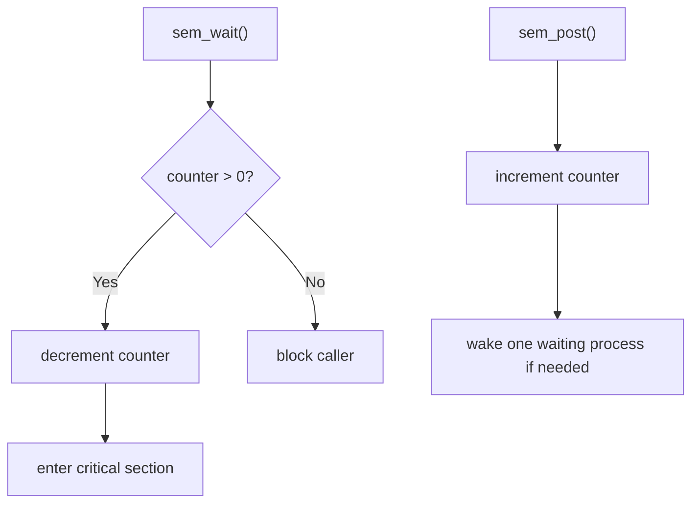

### Binary vs counting semaphore

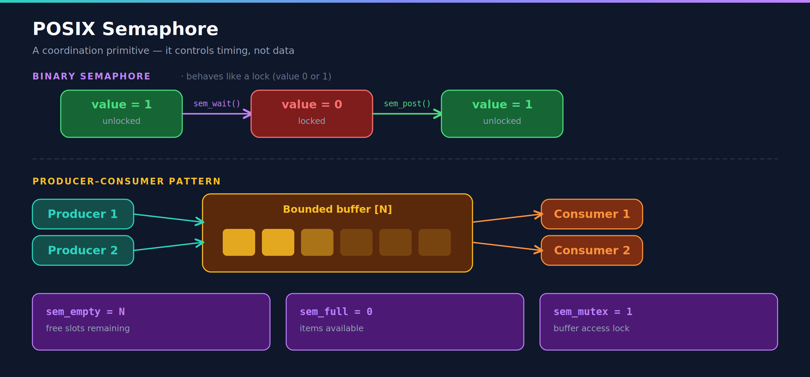

| Type | Meaning | Common use |
|---|---|---|
| Binary semaphore | Counter behaves like 0/1 | Mutual exclusion / lock |
| Counting semaphore | Counter ranges from 0..N | Resource pool / capacity limiting |

### What semaphores are good at

- protecting shared memory,
- producer-consumer coordination,
- startup/shutdown ordering,
- limiting concurrency,
- guarding critical sections.

### Strengths and weaknesses

| Advantages | Disadvantages |
|---|---|
| Great for synchronization | Does not carry application data |
| Works across processes | Incorrect usage can deadlock |
| Counting model fits resource pools | Debugging timing bugs is hard |
| Natural companion to shared memory | Priority inversion can still matter |

### Example files

| File | Description |
|------|-------------|
| [`01_sem_basic.c`](src/04_semaphore/01_sem_basic.c) | Basic semaphore coordination |
| [`02_sem_producer_consumer.c`](src/04_semaphore/02_sem_producer_consumer.c) | Bounded-buffer synchronization |
| [`03_sem_resource_pool.c`](src/04_semaphore/03_sem_resource_pool.c) | Limit access to a resource pool |

---

## 5. Socket

**Sockets** are the most flexible IPC mechanism.

They support:

- local communication on one host,
- network communication across hosts,
- full-duplex communication,
- stream or datagram semantics,
- standard client-server design patterns.

### Mental model

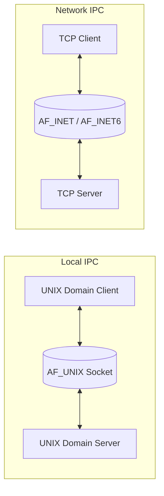

### UNIX domain vs Internet domain

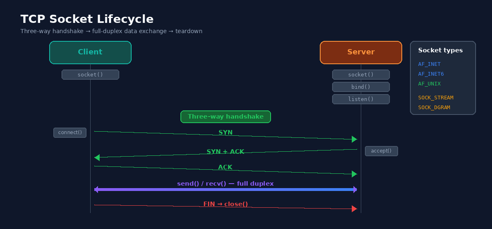

| Type | Addressing | Scope | Typical use |
|---|---|---|---|
| UNIX domain socket | Filesystem path or abstract namespace | Same machine | DB sockets, Docker, local daemons |
| Internet domain socket | IP address + port | Same machine or network | Web services, remote systems |

### Stream vs datagram

| Style | Typical protocol | Characteristics |
|---|---|---|
| Stream | TCP, UNIX stream socket | Ordered byte stream, connection-oriented |
| Datagram | UDP, UNIX datagram socket | Message-oriented, packet based |

### Why sockets matter

They are the only mechanism in this repository that naturally scales from:

- **local process communication**
- to **distributed system communication**

with a mostly familiar programming model.

### Strengths and weaknesses

| Advantages | Disadvantages |
|---|---|
| Full-duplex communication | More complex setup |
| Works locally and over networks | More error handling needed |
| Huge ecosystem and tooling support | More overhead than shared memory |
| Stream and datagram options | Network exposure adds security concerns |
| UNIX domain sockets are excellent for local services | Connection lifecycle must be managed |

### Example files

| File | Description |
|------|-------------|
| [`01_tcp_server.c`](src/05_socket/01_tcp_server.c) | TCP server |
| [`02_tcp_client.c`](src/05_socket/02_tcp_client.c) | TCP client |
| [`03_unix_domain_server.c`](src/05_socket/03_unix_domain_server.c) | UNIX domain socket server |
| [`04_unix_domain_client.c`](src/05_socket/04_unix_domain_client.c) | UNIX domain socket client |
| [`05_udp_echo.c`](src/05_socket/05_udp_echo.c) | UDP echo example |

---

## 6. Signal

A **signal** is an asynchronous notification delivered by the kernel to a process.

Signals are different from the other IPC methods here because they are generally used to say:

- **something happened**

rather than to carry meaningful payload data.

### Mental model

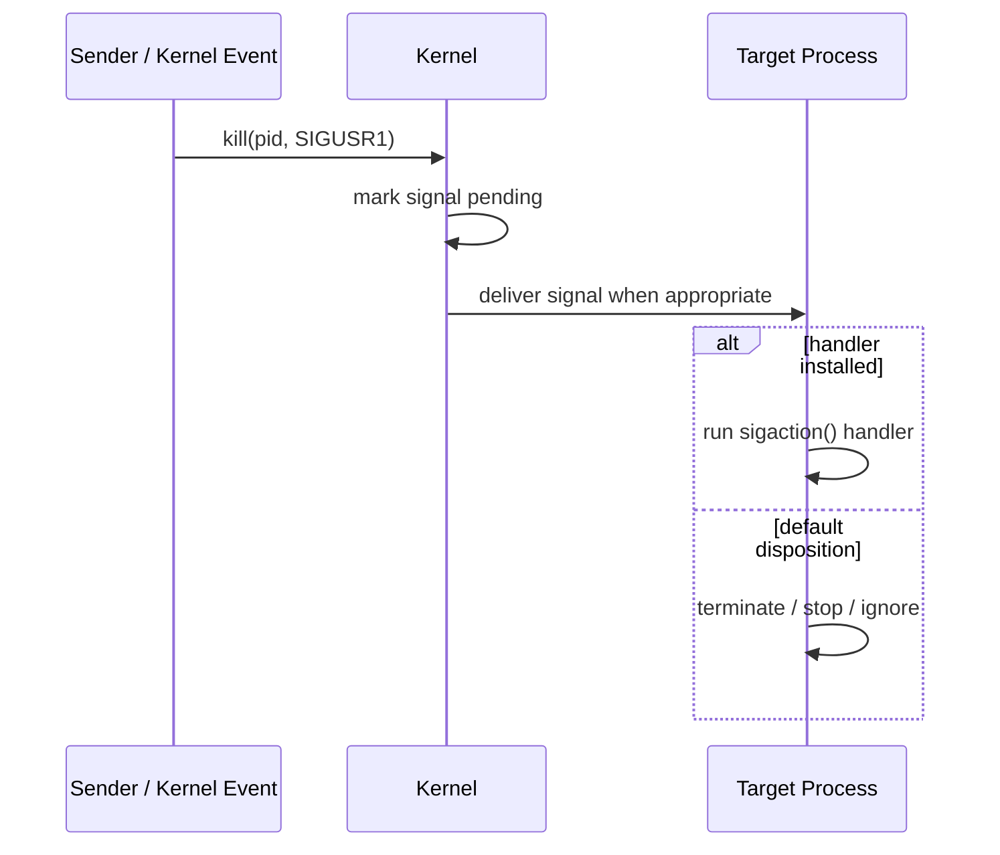

### Common roles of signals

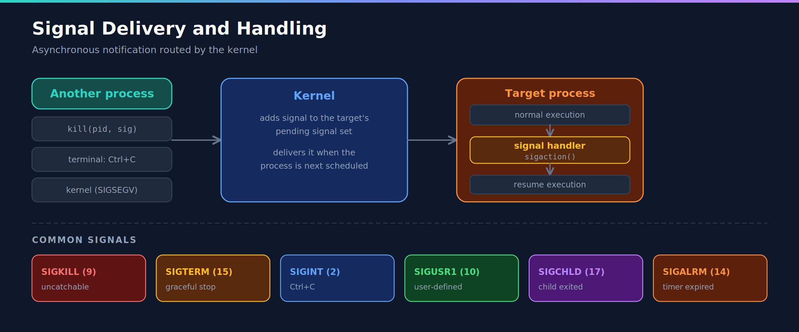

- graceful shutdown (`SIGTERM`, `SIGINT`),
- child state changes (`SIGCHLD`),
- alarms and timers (`SIGALRM`),
- user-defined notifications (`SIGUSR1`, `SIGUSR2`),
- exceptional conditions.

### Important caveats

Signal handlers are restricted contexts.

Inside a handler, only **async-signal-safe** operations are safe. That is why robust programs often keep handlers minimal, for example:

- set a `volatile sig_atomic_t` flag,
- write a short message with `write()`,
- return,
- let the main loop perform the real cleanup.

### Strengths and weaknesses

| Advantages | Disadvantages |
|---|---|
| Extremely lightweight notification | Carries almost no data |
| Built into the process model | Handlers are tricky to write safely |
| Useful for lifecycle events | Standard signals are not reliable message channels |
| Good companion to other IPC methods | Control flow becomes asynchronous |

### Example files

| File | Description |
|------|-------------|
| [`01_basic_handler.c`](src/06_signal/01_basic_handler.c) | Basic signal handling |
| [`02_signal_between_processes.c`](src/06_signal/02_signal_between_processes.c) | Process-to-process signaling |
| [`03_timer_alarm.c`](src/06_signal/03_timer_alarm.c) | Timer-based signals |
| [`04_graceful_shutdown.c`](src/06_signal/04_graceful_shutdown.c) | Clean shutdown handling |

---

## Choosing the Right IPC Mechanism

The best IPC mechanism depends on the shape of the problem.

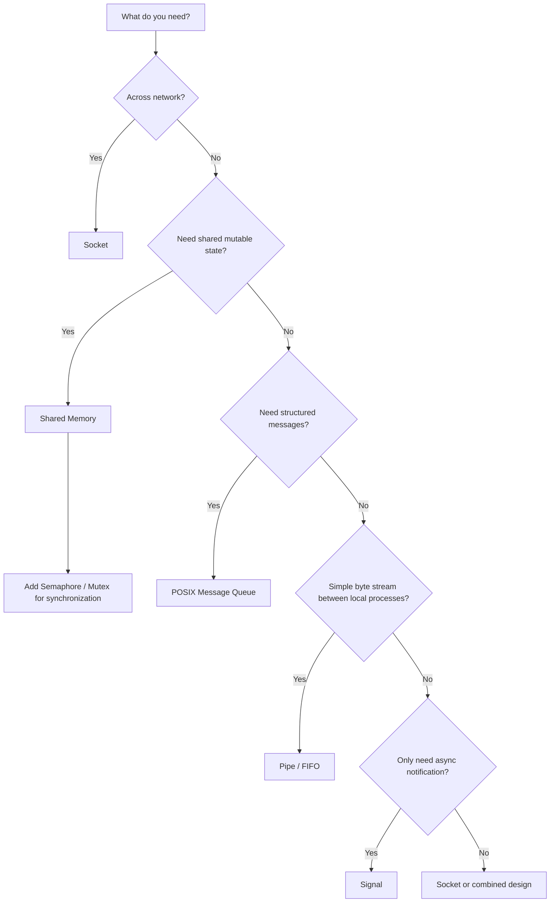

### Practical rules of thumb

- Use **pipes** when the model is simple streaming.
- Use **message queues** when messages are discrete and priorities matter.
- Use **shared memory** when throughput matters most.
- Use **semaphores** when correctness depends on coordination.
- Use **UNIX domain sockets** for local services.
- Use **TCP/UDP sockets** for networked systems.
- Use **signals** for lightweight notification, not bulk data transfer.

---

## IPC Comparison Matrix

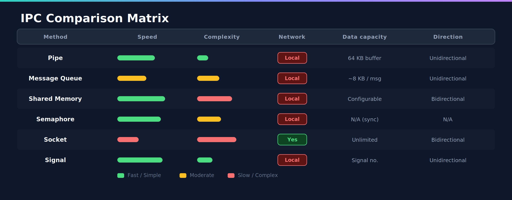

| Mechanism | Data Model | Sync Built-In | Works Between Unrelated Processes | Network Capable | Performance | Best For |
|---|---|---:|---:|---:|---|---|
| Pipe | Byte stream | Yes | Limited | No | Good | Parent-child streaming |
| FIFO | Byte stream | Yes | Yes | No | Good | Simple local process channels |
| POSIX Message Queue | Message | Partial | Yes | No | Medium | Prioritized task/event queues |
| Shared Memory | Shared state | No | Yes | No | Excellent | Large / high-frequency data sharing |
| Semaphore | No payload | N/A | Yes | No | Excellent | Synchronization |
| UNIX Domain Socket | Stream / datagram | No | Yes | Local only | Good | Local services |
| TCP/UDP Socket | Stream / datagram | No | Yes | Yes | Medium | Client-server / distributed systems |
| Signal | Tiny notification | N/A | Yes | No | Excellent | Events and lifecycle notifications |

---

## 7. Capstone Project: Distributed Task Manager

The capstone ties the mechanisms together into one practical architecture.

### High-level idea

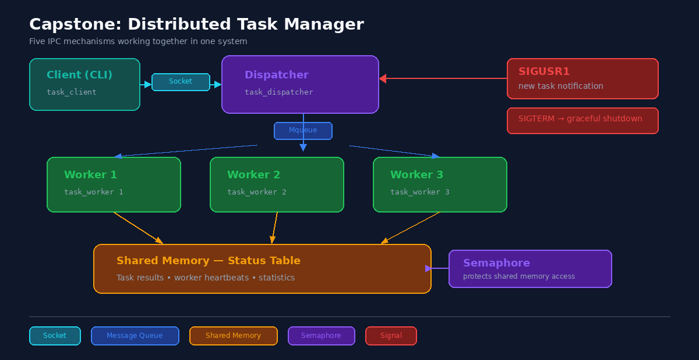

A **dispatcher** accepts commands, pushes work into a task queue, coordinates workers, and exposes system state to clients.

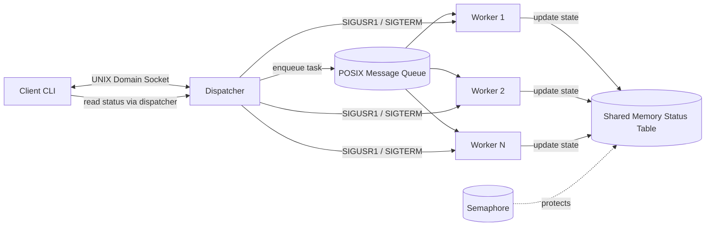

### IPC integration map

| IPC Method | Role in the Capstone |
|---|---|
| **UNIX Domain Socket** | Client ↔ dispatcher command channel |
| **POSIX Message Queue** | Dispatcher → worker task delivery |
| **POSIX Shared Memory** | Shared status/results table |
| **POSIX Semaphore** | Protect shared status table |
| **Signal (`SIGUSR1`)** | Wake or notify workers |
| **Signal (`SIGTERM`)** | Graceful shutdown coordination |

### Components

| Component | File | Role |
|-----------|------|------|
| **Dispatcher** | `task_dispatcher.c` | Accepts commands, schedules work, tracks system state |
| **Worker** | `task_worker.c` | Consumes tasks and publishes results |
| **Client** | `task_client.c` | CLI interface for users |

### Example run

```bash
# Build the capstone
make project

# Terminal 1
./build/task_dispatcher

# Terminal 2
./build/task_worker 1

# Terminal 3
./build/task_worker 2

# Terminal 4
./build/task_client
```

---

## Building & Running

### Prerequisites

- Linux system
- GCC or Clang with C11 support
- `make`
- Standard POSIX development environment

### Quick Start

```bash
# Clone the repository
git clone https://github.com/hurkanyagiz/Linux-Ipc.git
cd Linux-Ipc

# Build everything
make all

# Run selected demos
make pipe       && ./build/01_basic_pipe
make mqueue     && ./build/01_mq_basic_send && ./build/02_mq_basic_receive
make shm        && ./build/01_shm_write && ./build/02_shm_read
make semaphore  && ./build/02_sem_producer_consumer
make signal     && ./build/02_signal_between_processes

# Socket demo (two terminals)
make socket
./build/01_tcp_server        # terminal 1
./build/02_tcp_client        # terminal 2

# Capstone
make project
```

---

## Project Structure

```text
linux-ipc-guide/
├── README.md
├── Makefile
├── LICENSE
├── diagrams/
│   ├── linux-ipc-banner.png
│   ├── ipc-overview.png
│   ├── ipc-selection-guide.png
│   ├── ipc-comparison-matrix.png
│   ├── pipe-mechanism.png
│   ├── mqueue-mechanism.png
│   ├── shm-mechanism.png
│   ├── semaphore-mechanism.png
│   ├── socket-mechanism.png
│   ├── signal-mechanism.png
│   └── capstone-architecture.png
├── docs/
│   ├── NOTES.md
│   ├── TLPI_SOURCE_MAP.md
│   └── GITHUB_METADATA.md
├── src/
│   ├── 01_pipe/
│   ├── 02_message_queue/
│   ├── 03_shared_memory/
│   ├── 04_semaphore/
│   ├── 05_socket/
│   ├── 06_signal/
│   └── 07_capstone_project/
│       ├── include/
│       └── src/
└── build/                  # generated by make (git-ignored)
```

---

## GitHub Setup Notes

To make the repository look stronger as a portfolio project, a ready-to-use GitHub metadata file was added:

- [`docs/GITHUB_METADATA.md`](docs/GITHUB_METADATA.md)

That file contains:

- repo description suggestions,
- a shorter About text,
- topic/tag suggestions,
- suggested pin text,
- and a short project summary you can reuse in applications or CVs.

---

## Source Map

This README is conceptually organized around the following topics from **The Linux Programming Interface** and related Linux/POSIX material:

| README Section | Main Source Area |
|---|---|
| IPC overview and taxonomy | Chapter 43 |
| Pipe / FIFO | Chapter 44 |
| POSIX message queue | Chapter 52 |
| POSIX shared memory | Chapter 54 |
| POSIX semaphore | Chapter 53 |
| Signals | Chapters 20–22 |
| Sockets | Chapters 56–61 |
| Alternative I/O models | Chapter 63 |

> **Note on diagrams:** the PNG diagrams in this README are original visuals created for this repository. They are conceptually inspired by Linux IPC models and the chapter structure above, rather than copied from any book figure.

---

## References

- Michael Kerrisk, **The Linux Programming Interface**
- W. Richard Stevens, **Advanced Programming in the UNIX Environment**
- W. Richard Stevens, **UNIX Network Programming**
- `man 7 pipe`
- `man 7 fifo`
- `man 7 mq_overview`
- `man 7 shm_overview`
- `man 7 sem_overview`
- `man 7 socket`
- `man 7 unix`
- `man 7 signal`
- POSIX.1 / IEEE Std 1003.1

---

## License

This project is released under the [MIT License](LICENSE).

Educational use is encouraged.
